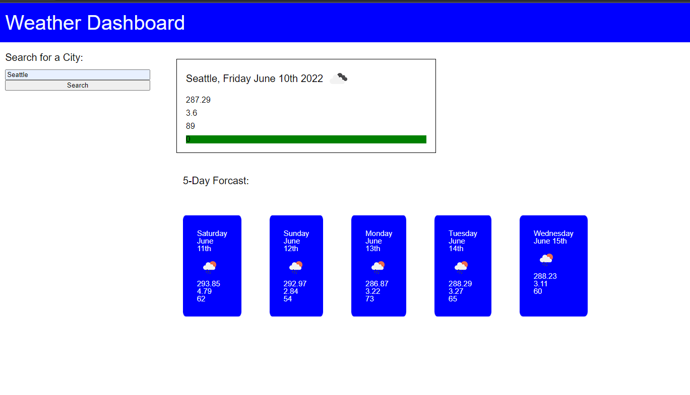

# Weather-Dashboard

## Description
This website allows the user to search any city, and quickly find out the weather for the current day, as well as weather for the next five days. It was an excercise in learning Server Side APIs.

## Usage
Type any city into the search bar, and click on the search button. Then results will appear show in the main bar for the current day, and the next five days in the five day forcast section.

